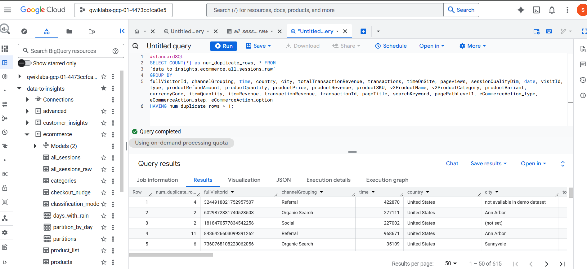
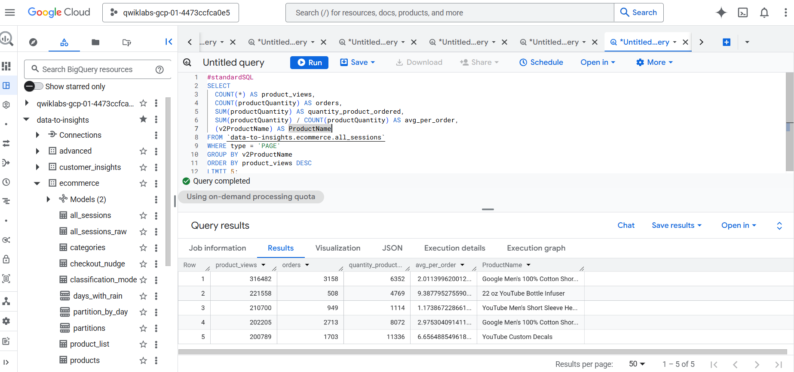

# Ecommerce Data Analysis with BigQuery

Projeto de análise de dados de ecommerce utilizando SQL no Google BigQuery com foco em exploração de dados, métricas de conversão e comportamento de usuários.

## Objetivo

O objetivo deste projeto é explorar um dataset de ecommerce utilizando consultas SQL no BigQuery para identificar padrões de navegação, conversão de vendas e abandono de carrinho.

## Ferramentas Utilizadas

- Google BigQuery
- SQL
- Google Cloud Platform

## Dataset

Google Merchandise Store Ecommerce Dataset

Dataset público utilizado em laboratório prático do Google Cloud Skills Boost.

## Análises Realizadas

- Identificação de registros duplicados
- Contagem de visitantes únicos
- Análise de canais de aquisição
- Produtos mais visualizados
- Taxa de conversão de produtos
- Média de itens por pedido
- Jornada de checkout
- Abandono de carrinho
- Sessões de alta qualidade

## Estrutura do Projeto

```txt
├── data/
│   ├── arquivos CSV exportados das consultas
│
├── imagens/
│   ├── prints das consultas e resultados
│
├── sql/
│   ├── consultas SQL utilizadas no projeto
│
└── README.md
```

## Exemplos de Consultas SQL

### Produtos mais visualizados

```sql
SELECT
  COUNT(*) AS product_views,
  v2ProductName AS ProductName

FROM `data-to-insights.ecommerce.all_sessions`

WHERE type = 'PAGE'

GROUP BY v2ProductName

ORDER BY product_views DESC

LIMIT 5;
```

### Visitantes únicos

```sql
SELECT
  COUNT(DISTINCT fullVisitorId) AS unique_visitors

FROM `data-to-insights.ecommerce.all_sessions`;
```

## Imagens do Projeto

### Identificação de registros duplicados



### Análise de desempenho dos produtos



## Principais Insights

- Nem os produtos mais visualizados apresentaram maior quantidade de pedidos.
- Apenas parte dos usuários que adicionaram itens ao carrinho concluíram a compra.
- Sessões com maior qualidade apresentaram maior potencial de conversão.
- Foi possível identificar padrões de abandono de carrinho através das etapas do checkout.

## Origem do Projeto

Projeto desenvolvido com base em laboratório prático da plataforma Google Cloud Skills Boost, com documentação e organização própria.

## Autor

Marcos Vinícius
